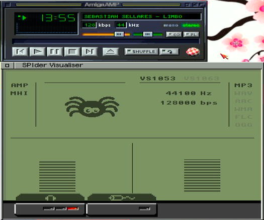

# SPIAudio
SPI MHI library 1.5 for the VS10X3 SPIder device. Now supports both VS1053 and VS1063 chipsets. 
VS1063 offers some improved format support, but drops MIDI (no implementation in driver anyway) and MPEG layer 1. It has a slight boost in communication speeds with SPIder.
The most noticable is the support for 5 band EQ in AmigaAmp. VS1053 only support bass and treble at 64 and 16k, and it's a bit weak. VS1063 kicks in across bands 64, 250, 1k, 4k and 16k.

Do you want to play MP3, OGG or other compressed formats on your Amiga? Maybe it doesn't have a super fast CPU or you want to offload the work whilst getting on with other things. 
This library/device driver provides an MHI interface through the SPIder clockport. 

Includes standard VS1053B and VS1063 patches including ADMIX patch for audio passthrough on VS1053.

The driver comes with a visualiser tool (spidervis) providing a VU meter using data from the VS10X3 hardware. This plugs a gap with players like AmigaAmp that cannot display any VU metering when using MHI.


The visualiser works as an AmigaAMP plug-in and stand-alone MHI tool.

## Setup
Wire the following together from SPIder to VS10X3. The pin names refer to the Adafruit VS1053 v2 board
```
3V3 -> 3V3 (can alternatively be 5V to VCC if 3.3 regulator built into board)
GND -> GND
IO16 -> MISO
IO17 -> CS
IO18 -> SCLK
IO19 -> MOSI
IO21 -> DREQ
IO29 -> RESET (optional, but if excluded then add 1k pull up to reset pin on VS10X3)
```

RST pin on the VS10X3 must be pulled up to V3.3/5 if RESET connection excluded.
Other wiring required for audio out. See [Adafruit wiring guide](https://learn.adafruit.com/adafruit-vs1053-mp3-aac-ogg-midi-wav-play-and-record-codec-tutorial/simple-audio-player-wiring) for more info.
You may damage your audio equipment or VS10X3 board if audio capacitors are not provided to line out or input lines [see Adafruit guidance](https://learn.adafruit.com/adafruit-vs1053-mp3-aac-ogg-midi-wav-play-and-record-codec-tutorial/audio-connections) for more info.

## Using MHI library
Copy **mhispiaudio.library** to your **LIBS:MHI/** directory. If you don't have an MHI directory then create one to put the library into.

[AmigaAMP](https://www.amigaamp.de/download.shtml) and Hippoplayer (with the [Hippoplayer update](https://aminet.net/package/mus/play/hippoplayerupdate) from Aminet) both support MHI playback. 
Install these and point the players (via configuration) to the copied MHI library. 

VS10X3 can play a lot more formats than these players support. The command line **audio-test** can be used to try different files out and these should play. Note that this test program should not
be used at the same time as the MHI library due to it closing resources that MHI wants. 

Even though this offloads to a decoder, the system will still be busy transferring file data. You may notice slower performance for file IO when playing music. Stopping playback should restore
the system to normal.

## Spidervis
Run **spidervis** from Workbench or a shell. 
If AmigaAMP is already running then the letters **AMP** will display in bold on the UI. If it shows faded in grey then run AmigaAMP and it should change (check you have the latest version of AmigaAMP if it doesn't connect).
The **MHI** letters will show in bold if you've installed the **mhispiaudio.library** into **LIBS:MHI/** directory. If it shows faded in grey then check you have installed the latest spidervis and mhi library as version differences will not establish connection.

Pressing play on any MP3 in AmigaAMP or Hippoplayer will start the visualiser (as long as apps properly configured to use MHI and the library is installed correctly). Frequency and bit rate should populate in the visualiser. 
Your hardware will also be detected and shown as either VS1053 or VS1063. 

You can use the **audio-test** command line application to run other compressed formats. When these formats are run then the visualiser will change the right hand column to show the identified format. 
Note that MP3 is a bit inaccurate if playing older MPEG formats. It's a generalisation of this format with MP3 being typical. 

Spidervis can be opened and closed at any time. It isn't required to play compressed files and just serves to provide info from the hardware. 

You don't need MHI installed at all to use this as plug-in for AmigaAMP. 

## Known issues
Popping and clicking on initialisation (maybe nothing can be done on setup).
MHI library runs the processing task at priority 5 to ensure some activities in Workbench do not interrupt buffer processing, but you can still experience some pauses whilst system is busy.
I did look at higher priorties but this causes some unexpected issues with signal processing. 

Spidervis may struggle to reserve all the colours it needs, especially on low colour Workbench. Try increasing the colour depth if you experience missing graphics. 

## Build
Requires fd2pragma 2.171 [Aminet Download](https://aminet.net/package/dev/misc/fd2pragma).

Install https://github.com/AidanHolmes/spiderdev into a sibling directory called lib. Follow the build guide. 
Download and install [MHI_DEV](https://aminet.net/driver/audio/mhi_dev.lha) into sibling lib directory

Like this:
```
Projects/
  lib/
    spiderdev
	mhi_dev
  spiaudio
```
Requires 1.0.2 SPIder firmware

### SAS/C
Code is setup to build using SAS/C 6.5 and tools such as **oml**, **smake** and **splat** which come with SAS/C. 

Type **smake** in spiaudio directory to build Release and Debug targets

### VBCC
Fd2pragma download only comes with an Amiga binary executable.
For cross compiler users you will need to build **fd2pragma** from source to then run on Linux x86 platforms.
Building **fd2pragma** is easy using the Aminet source code:
```
gcc -Wall -O3 -o fd2pragma fd2pragma.c
```
The **makefile.vbcc** assumes **/opt/amiga/tools/** location used for **fd2pragma**. Copy there or if you install elsewhere then update the **makefile.vbcc** to reference it.
Once **fd2pragma** has been built and copied to your Linux system files then find the **fd2pragma.types** file and copy to **/usr/local/share**. You will need to do this as root and ensure it is readable.

MHI doesn't come with inline VBCC headers. These need building with **fd2pragma**.
Copy **fd2pragma.types** to current directory in **lib/mhi_dev**.
Run:
```
mkdir Include/inline
fd2pragma --infile=Include/fd/mhi_lib.fd --clib=Include/clib/mhi_protos.h --special=70 --to=Include/inline
```

Finally you can build everything from the root **spiaudio** directory with:
```
make -f makefile.vbcc
```
This creates Release and Build targets. As Linux doesn't have a proper LHA packer, the archive is compressed and tar'd.